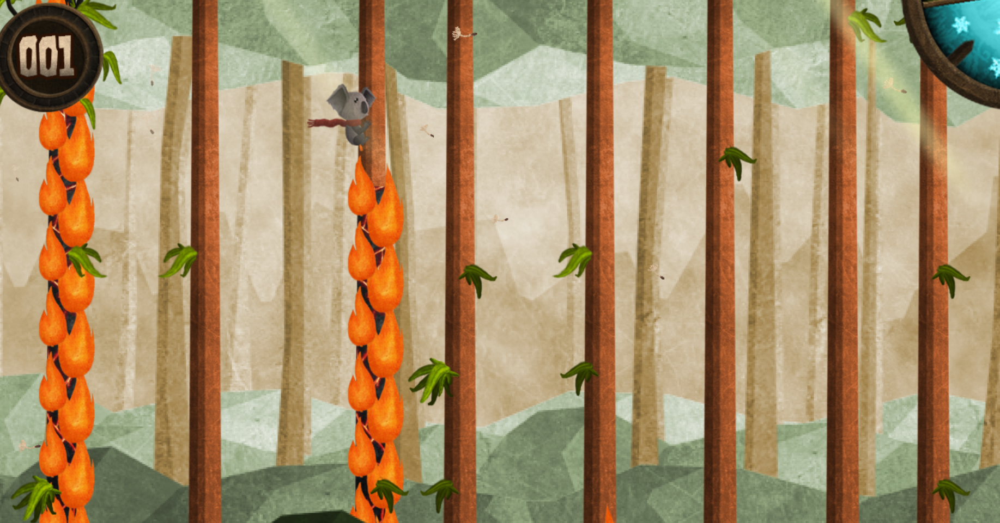
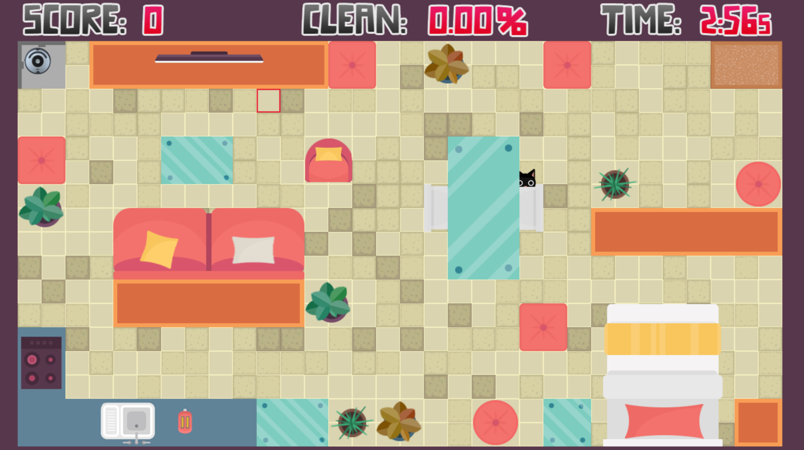
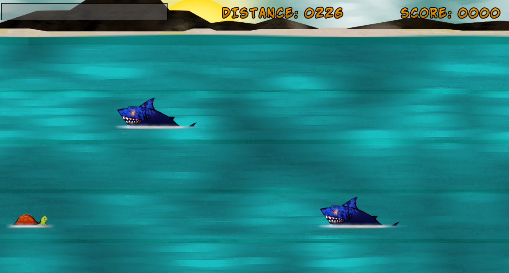
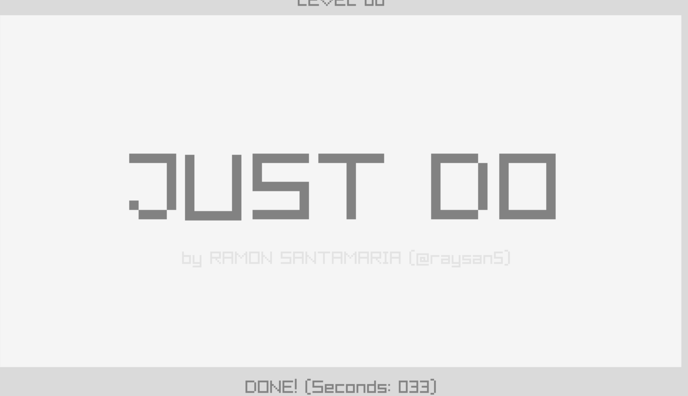
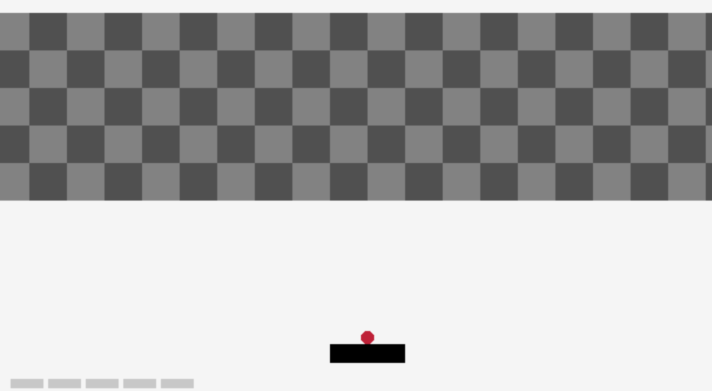
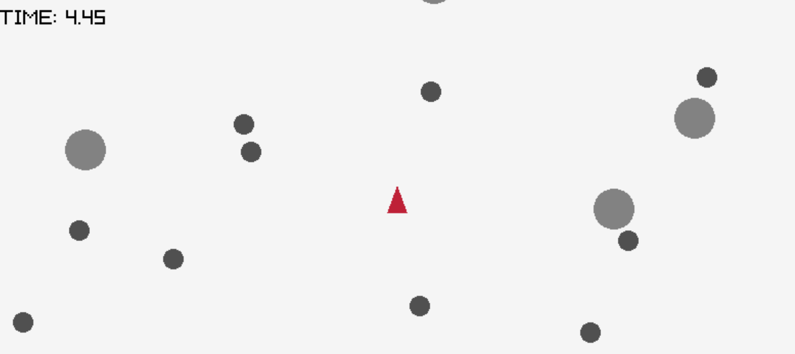

# Raylib games

Here you can see what can be done with raylib

Click inside the image

Haz click en la imagen

## koala_seasons
  

## cat_vs_roomba

## drturtle

## just_do

## Arkanoid

## Asteroids

## Floppy

</ul>